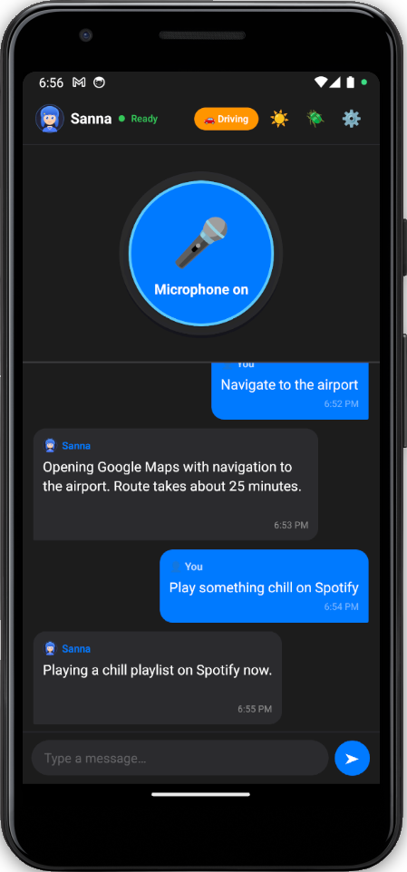
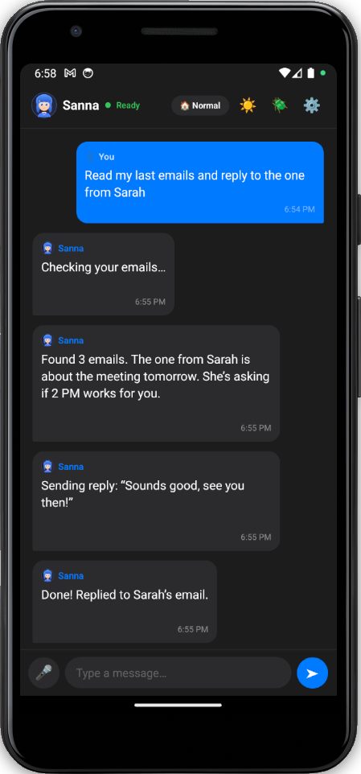
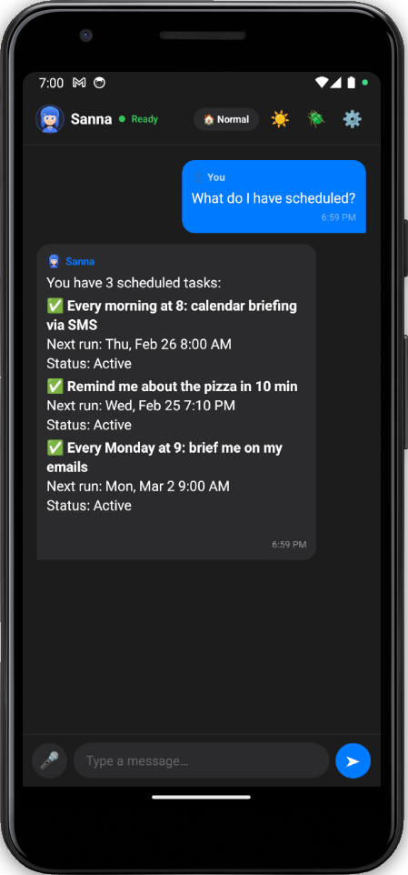
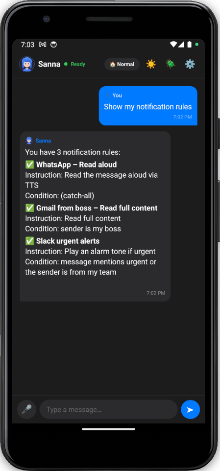
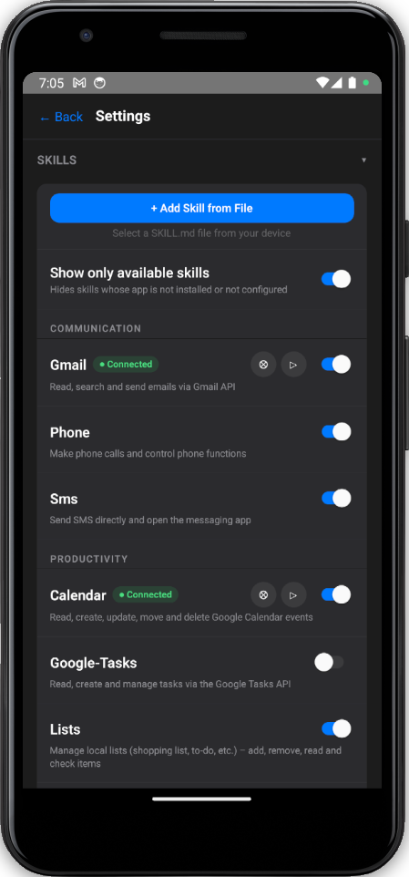
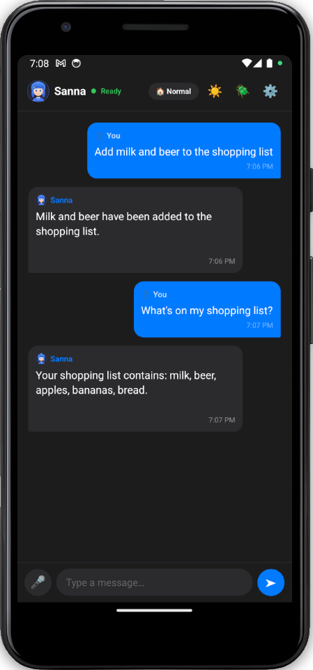

# 🎤 Sanna – Voice-First AI Assistant for Android

**What OpenClaw does for your desktop, Sanna does for your phone.**

An open-source AI assistant that runs on Android and actually *controls* your phone – not just talks about it. Powered by an LLM agent loop (OpenAI or Claude) that reasons, chains actions, and executes tools until the job is done.

> "Hey Sanna, read my last 3 emails, summarize them, and text the summary to Sarah" — just works.

## 🎯 Beta Testing

There are two ways to get a beta release of Sanna:

1. **Build it yourself** – Configure and build the app following the instructions in [DEVELOP.md](DEVELOP.md). Note that this can be time-consuming as you'll need to create many API keys (OpenAI/Claude, Google, Spotify, Picovoice, Slack) for the app to be fully functional.
2. **Request a Test APK** – Write to [sannabot@proton.me](mailto:sannabot@proton.me) and you'll receive a pre-built test APK for beta testing.

## 📸 Screenshots

| Driving Mode | Agent Conversation | Scheduler |
|:---:|:---:|:---:|
|  |  |  |

| Notification Rules | Skills | Lists |
|:---:|:---:|:---:|
|  |  |  |

## ✨ Highlights

- **🗣️ Voice-first** – Wake word ("Hey Sanna") → Speech-to-Text → LLM agent → Text-to-Speech, fully hands-free
- **🪄 Persona (SOUL)** – Give Sanna a personality. Define her tone, style, and character in plain text. Editable in Settings, supports voice dictation (STT), persists across reinstalls.
- **🧠 Personal Memory** – Sanna remembers facts about you: name, family, job, home, hobbies, anniversaries, birthdays, important events. When you mention a personal detail, she writes it into a structured personal memory that is injected into every prompt. Curated automatically by the LLM – deduplicated and condensed on every update.
- **📝 Skills are Markdown** – Drop a `SKILL.md` in a folder, the agent learns a new capability. No code changes.
- **🔄 Agentic tool loop** – LLM → tool call → result → back to LLM, until final answer. Multi-step reasoning out of the box.
- **📋 Local list management** – Shopping lists, to-dos, packing lists – stored on-device, fully offline, no cloud.
- **⏰ Sub-agent scheduler** – Schedule natural-language tasks ("Every Monday at 9am, brief me on today's calendar via SMS"). A real LLM executes them – not a dumb cron job.
- **🔔 Notification rules** – Define what happens when a notification arrives: read it aloud, auto-reply, play an alarm – each rule spawns its own LLM sub-agent with full tool access.
- **🤖 UI Automation** – Controls other apps via Android Accessibility Services. An LLM sub-agent reads the UI tree, clicks buttons, types text – e.g. sends WhatsApp messages without any API.
- **🧩 Learning Accessibility** – The system learns from every UI interaction: After each run, successful and failed flows are condensed into natural language and stored per app. On the next task for the same app, these hints are automatically injected into the system prompt, enabling the agent to learn from past experiences and improve over time.
- **🚗 Driving mode** – Short spoken responses, auto-reads incoming notifications, optimized for hands-free use.
- **🔒 No backend needed** – OAuth flows use PKCE. All data stays on your device.

## 📦 16 Built-in Skills

| Skill | What it does |
|-------|-------------|
| 📧 Gmail | Read, search, send, and reply to emails |
| 📅 Calendar | Query and create Google Calendar events |
| ✅ Google Tasks | Manage task lists and items |
| 💬 Slack | Read/send messages, manage DMs, set status |
| 🎵 Spotify | Playback control via Web API |
| 📱 WhatsApp | Send messages via Android Intents |
| 💬 SMS | Send SMS directly in the background |
| 📞 Phone | Make calls |
| 👤 Contacts | Search and query contacts |
| 🗺️ Google Maps | Start navigation |
| 🔔 Notifications | Rule-based notification handling with LLM sub-agents |
| ⏰ Scheduler | Autonomous scheduled tasks with sub-agents |
| ⏱️ Timer | Countdown timers and stopwatches with acoustic alarms |
| 📝 Journal | Create and manage journal entries to track activities, events, and notes |
| 📋 Lists | Manage local lists (shopping, to-do, packing) – fully offline |
| 🌤️ Weather | Current weather & forecasts via wttr.in / Open-Meteo – no API key |

## 💡 Usage Examples

Sanna is conversational – just speak or type naturally. Here are some things you can do:

### 📧 Email

| You say | What happens |
|---------|-------------|
| "Read my last 3 emails" | Fetches Gmail inbox, summarises sender + subject |
| "Search for emails from the bank" | Searches Gmail by sender |
| "Reply to the last email: sounds good, thanks" | Sends a reply to the most recent message |
| "Send an email to sarah@example.com about the meeting tomorrow" | Composes and sends a new email |

### 📅 Calendar & Tasks

| You say | What happens |
|---------|-------------|
| "What's on my calendar today?" | Lists today's Google Calendar events |
| "Am I free at 3 PM?" | Checks for conflicts |
| "Create an appointment: dentist Friday at 10 AM" | Creates a calendar event |
| "What are my open tasks?" | Lists Google Tasks |
| "Add 'buy flowers' to my tasks" | Creates a new task item |

### ⏰ Scheduler (Background Sub-Agents)

The scheduler creates autonomous tasks that run in the background at the specified time. Each task is executed by an independent LLM sub-agent with full tool access.

| You say | What happens |
|---------|-------------|
| "Remind me in 10 minutes about the pizza" | Plays an alarm + TTS at the scheduled time |
| "Every morning at 8, read me today's calendar" | Recurring: fetches calendar and speaks via TTS daily |
| "Send an SMS to +43660123456 at 2 PM: on my way" | One-time: sends the SMS at 14:00 |
| "Every Monday at 9, brief me on my emails" | Recurring: fetches Gmail and speaks a summary weekly |
| "What do I have scheduled?" | Lists all active schedules |
| "Delete the pizza reminder" | Removes a schedule by description |

> The sub-agent is a full LLM with all tools – it can read emails, send messages, play sounds, and speak via TTS, all without you touching the phone.

### 🔔 Notifications (Rule-Based Sub-Agents)

Notification rules tell Sanna what to do when a notification arrives from a specific app. Each rule has an **instruction** (what the sub-agent should do) and an optional **condition** (when it should trigger, evaluated by the LLM).

| You say | What happens |
|---------|-------------|
| "Read WhatsApp messages to me" | Creates a catch-all rule: every WhatsApp notification is read aloud via TTS |
| "When my boss writes an email, read the full content" | Creates a conditional rule: only triggers when the LLM determines the sender matches |
| "When someone from my team writes on Slack and it's urgent, play an alarm" | Conditional: LLM evaluates sender + content semantically |
| "Auto-reply to WhatsApp messages from my partner with 'I'm driving'" | Sub-agent uses the WhatsApp tool to send a reply |
| "Stop WhatsApp notifications" | Removes all rules for WhatsApp |
| "What notification rules do I have?" | Lists all active rules with conditions and instructions |

**How it works:**
1. You tell Sanna to subscribe to an app (e.g. "read me WhatsApp messages")
2. Sanna creates a notification rule with an instruction and optional condition
3. When a notification arrives, the LLM evaluates the condition against the notification content
4. If it matches, an independent sub-agent executes the instruction with full tool access
5. If no condition matches, nothing happens – the notification is silently skipped
6. The main conversation pipeline stays free the entire time

> Conditions are evaluated **semantically** by the LLM – "The sender is my boss" works even without specifying an exact name. Multiple rules can exist for the same app, with the most specific (conditional) rule taking priority.

### ⏱️ Timer

Simple countdown timers and stopwatches with acoustic alarms. Examples: "Egg timer 20 seconds", "Set a timer for 3 minutes", "Start stopwatch for running", "What timers are running?"

### 📝 Journal

Create and manage journal entries to track activities, events, and notes. Stored locally on-device. Examples: "Make an entry in the journal that I went jogging today", "Show me my journal entries", "What journal entries are in the Work category?"

### 📋 Lists

Lists are stored locally on-device – no internet, no cloud, no account needed.

| You say | What happens |
|---------|-------------|
| "Add milk and bread to my shopping list" | Creates the list if it doesn't exist, adds items |
| "What's on my shopping list?" | Reads the list aloud |
| "Remove bread from the shopping list" | Deletes the item |
| "Create a packing list for vacation" | Creates a new named list |
| "Check off milk" | Marks an item as done |

### 💬 Messaging

| You say | What happens |
|---------|-------------|
| "WhatsApp John: I'll be there in 10 minutes" | Looks up contact, sends via WhatsApp |
| "Text Mom: running late" | Sends an SMS (background, no UI) |
| "Call the dentist" | Looks up contact, initiates phone call |

### 🎵 Music & Media

| You say | What happens |
|---------|-------------|
| "Play some jazz on Spotify" | Searches and plays via Spotify Web API |
| "Next song" / "Pause" / "Resume" | Playback control |
| "Set volume to 60 percent" | Adjusts media volume |

### 🗺️ Navigation & Weather

| You say | What happens |
|---------|-------------|
| "Navigate to the airport" | Opens Google Maps turn-by-turn |
| "Will it rain tomorrow?" | Weather forecast for current GPS location |
| "What's the weather in Vienna?" | Weather for a specific city |

### 🤖 UI Automation (Learning Accessibility)

Sanna can control other Android apps via Accessibility Services – no API access needed. An LLM sub-agent reads the UI tree, clicks buttons, types text, and navigates through apps.

**What makes it special: The system learns from every interaction.**

| You say | What happens |
|---------|-------------|
| "Send a WhatsApp message to John: I'll be there in 10 minutes" | Opens WhatsApp, finds contact, types message, sends |
| "Post 'Hello world' on Twitter" | Opens Twitter/X, navigates to post editor, types text, sends |
| "Open Instagram and like the first post" | Opens Instagram, finds first post, clicks like button |

**How the learning works:**

1. **After each run** (successful or failed), an LLM analyzes the complete interaction history
2. **Condensation**: The full history (accessibility trees + actions) is compressed into 3–4 concise paragraphs of natural language
3. **Storage**: These hints are stored per app package (e.g., `com.whatsapp`, `com.twitter.android`)
4. **Reuse**: On the next task for the same app, the stored hints are automatically injected into the system prompt
5. **Continuous improvement**: The agent learns from past successes and failures – "✅ To achieve X: navigate to home, then click 'Y'..." or "❌ Attempting X via Y did NOT work because..."

**Example:**
- **First WhatsApp message**: The agent must explore WhatsApp's UI structure
- **Second WhatsApp message**: The agent has already learned how to navigate WhatsApp and send messages → faster and more reliable
- **After multiple runs**: The agent knows successful flows and avoids known pitfalls

> The hints contain **no node IDs** (those are ephemeral), but describe flows in natural language using button labels and UI text. This makes them robust against UI changes.

### 🔗 Multi-Step Chains

The agent loop means you can chain actions naturally:

| You say | What happens |
|---------|-------------|
| "Read my last email and reply with 'sounds good'" | Fetches email → composes reply → sends |
| "What's on my calendar tomorrow? Text the summary to Mom" | Calendar → format → SMS |
| "Add everything from my shopping list to a new Google Task list" | Reads file → creates tasks |

## 🚗 Driving Mode

Toggle driving mode with one tap. Sanna becomes a fully hands-free co-pilot:

| Feature | How it works |
|---------|-------------|
| **Voice-only interaction** | Wake word ("Hey Sanna") → speak your request → hear the answer. No screen touch needed. |
| **Ultra-short answers** | The LLM is instructed to reply in 1–2 sentences max – every word is read aloud, so brevity saves attention. |
| **Auto-read notifications** | Subscribe to WhatsApp, Telegram, SMS, email, etc. – incoming messages are summarised and spoken automatically. |
| **Navigation** | "Navigate to the airport" → opens Google Maps turn-by-turn navigation instantly. |
| **Calls & messages** | "Call Mom" / "Text Sarah: running 10 minutes late" / "WhatsApp John: on my way" – contact lookup, confirmation, and send, all by voice. |
| **Music control** | "Play Rammstein on Spotify" / "Next song" / "Pause" – full Spotify playback control via voice. |
| **Volume control** | "Set volume to 80 percent" / "Turn it down" – adjusts media volume directly. |
| **Calendar & schedule** | "What's my next appointment?" / "Am I free at 3 PM?" – reads your Google Calendar aloud. |
| **Weather** | "Will it rain tomorrow?" / "What's the weather?" – fetches weather for your GPS location or any city. |
| **Screen stays on** | Display never sleeps while driving mode is active – no unlock needed. |
| **Email triage** | "Read my latest emails" / "Reply to the last email: sounds good" – hands-free Gmail access. |

> Driving mode optimises every part of the pipeline: the system prompt enforces brevity,
> all responses are auto-spoken via TTS, and notifications from subscribed apps are read aloud in real time.

## 🏗️ Architecture

```
Wake Word (Picovoice) → STT → LLM Agent Loop → Tool Execution → TTS
                                    ↕
                           SKILL.md files (auto-discovered)
                                    ↕
                         Tools: intent, http, tts, device, file_storage,
                         sms, query, scheduler, notifications, accessibility,
                         timer, journal, app_search, beep, personal_memory
```

**Sub-agent architecture:** Both the scheduler and notification system spawn independent LLM sub-agents. These run in their own tool loop with full tool access, completely separate from the main conversation pipeline. The main pipeline stays free for user interaction at all times.

```
Main Pipeline (user conversation)
    ├── Scheduler Sub-Agent (time-triggered, background)
    ├── Notification Sub-Agent (event-triggered, per notification)
    └── Accessibility Sub-Agent (UI automation, per task)
        └── AccessibilityHintStore (learned hints per app, persisted in AsyncStorage)
```

**Persona & Memory injection:** Soul (persona) and Personal Memory are loaded from on-device storage and injected into the system prompt of every agent – main pipeline, notification sub-agent, and scheduler sub-agent. The accessibility sub-agent receives them read-only (no memory writes during UI automation). Memory writes (`memory_personal_upsert`) are restricted to the main loop only.

**Learning mechanism:** After each accessibility automation run, the full interaction history (accessibility trees + actions) is condensed by an LLM into natural-language hints. These hints are stored per app package and automatically injected into future runs for the same app, enabling the agent to learn from past experiences and improve over time.

- **React Native** + native **Kotlin** modules for Android-specific features
- **LLM providers**: OpenAI (`gpt-4o`) or Anthropic Claude – swap with one config line
- **Skill auto-discovery**: Metro's `require.context()` scans `assets/skills/*/SKILL.md` at build time
- **OAuth2 PKCE**: Google, Spotify, Slack – no server, no client secret

## 🚀 Quick Start

1. Clone the repo
2. `cp local.config.example.ts local.config.ts` and add your API keys
3. `npm install && npm run android`

See [DEVELOP.md](DEVELOP.md) for detailed credential setup (API keys, OAuth, etc.) and building instructions.

## 🤝 Adding a Skill

There are two ways to add a skill – **no rebuild required** for the upload path:

### Option 1: Upload at runtime (no rebuild)

Open **Settings → Skills → Upload Skill**, pick any `.md` file from your device, and the skill is live immediately. Uploaded skills are persisted in on-device storage and survive app restarts. You can also delete them from the same screen.

### Option 2: Bundle at build time

Create `assets/skills/your-skill/SKILL.md` – Metro auto-discovers it on the next build:

```markdown
---
name: your-skill
description: What this skill does
---
# Your Skill

## Tool: http

### Do something

```json
{
  "method": "GET",
  "url": "https://api.example.com/endpoint",
  "auth_provider": "google"
}
```

Both paths use the same `SKILL.md` format. The agent picks up the skill automatically – no code changes needed.

## 📄 License

MIT
